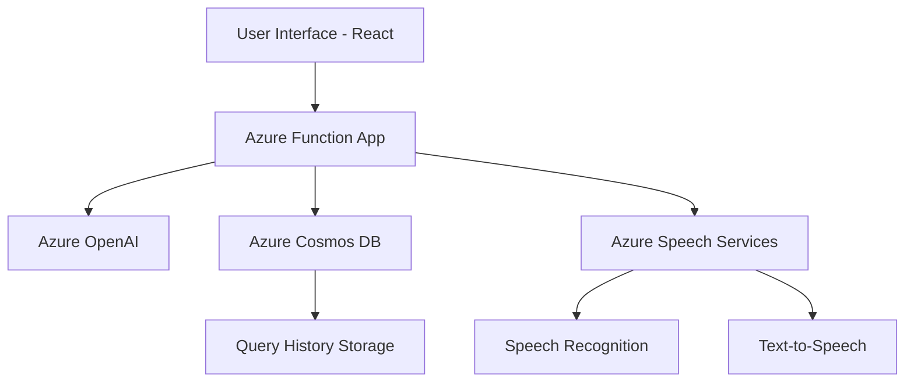

# 🚀 StackOverflow Conversational Assistant

## Microsoft Azure AI Developer Hackathon Project

### 🌟 Project Overview

The StackOverflow Conversational Assistant is a cutting-edge multi-modal application that revolutionizes how developers interact with technical content. By leveraging multiple Azure services, this innovative tool provides:

- Instant summaries of StackOverflow pages
- Interactive conversational AI
- Voice-enabled search and interaction
- Personalized query history

### 🔧 Technologies & Azure Services Used

- **Azure Function App**: Backend serverless compute
- **Azure OpenAI**: Intelligent summarization and conversational AI
- **Azure Cosmos DB**: Persistent query history storage
- **Azure Speech Services**: Voice input and text-to-speech capabilities
- **React**: Frontend user interface
- **Microsoft Cognitive Services**: Speech recognition and synthesis

### ✨ Key Features

1. **Intelligent Summarization**
   - One-click summary generation for StackOverflow pages
   - Extract key insights from technical discussions

2. **Conversational AI**
   - Interactive chat interface
   - Context-aware responses based on page content
   - Ask follow-up questions about the summarized content

3. **Voice-Enabled Interaction**
   - Voice input for URLs and queries
   - Text-to-speech for bot responses
   - Hands-free technical research

4. **Query History**
   - Personalized tracking of user interactions
   - Easy retrieval of past queries and summaries

### 🖥️ Technical Architecture



### 🚀 Getting Started

#### Prerequisites
- Node.js
- Azure Account
- Azure Function Core Tools
- Azure OpenAI Service
- Azure Cosmos DB
- Azure Speech Services

#### Installation Steps
1. Clone the repository
2. Install dependencies
   ```bash
   npm install
   ```
3. Set up Azure environment variables
4. Run the development server
   ```bash
   npm start
   ```

### 🌈 Hackathon Category Submissions

#### Best Use of Azure AI
- Multi-modal application with text, voice input/output
- Responsible AI implementation
- Intelligent content summarization

#### Best Azure App Integration
- Serverless architecture with Azure Functions
- Seamless integration of multiple Azure services
- Scalable and performant design

### 🔮 Future Enhancements
- Multi-language support
- Advanced code snippet handling
- Machine learning-based personalization
- Integration with more technical forums

### 🤝 Contributing
Contributions are welcome!

### 🏆 Hackathon Details
**Microsoft Azure AI Developer Hackathon**
- Showcase of GitHub Copilot and Azure AI capabilities
- Opportunity to build innovative, intelligent applications

### 👨‍💻 About ME..!!!

**Aatmaj Amol Salunke**
- MS in Artificial Intelligence Student
- Northeastern University, Boston
- 📧 Email: salunke.aa@northeastern.edu

---

**Developed with ❤️⚡ using Azure Services**
